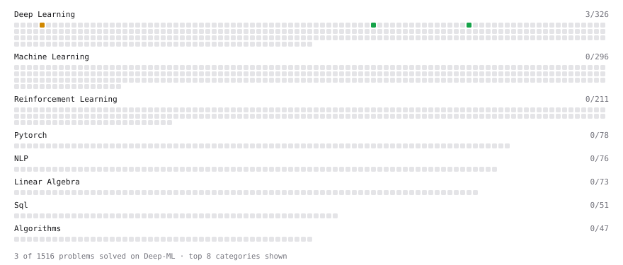

# Deep-ML

My machine learning practice from [Deep-ML](https://www.deep-ml.com). Every solution here was written by hand.

**3** solved · 3 problems · 0 labs · 0 math

[**Browse the interactive portfolio**](https://tokhirasulov.github.io/deep-ml/) to replay this filling in over time.

## Problems

| | Difficulty | Solved | |
| --- | --- | --- | --- |
| [Derivatives of Activation Functions](https://www.deep-ml.com/problems/217) | easy | 2026-10-09 | [solution](problems/0217-derivatives-of-activation-functions) |
| [Implement the Tanh Activation Function](https://www.deep-ml.com/problems/264) | easy | 2026-10-08 | [solution](problems/0264-implement-the-tanh-activation-function) |
| [Implementing Basic Autograd Operations](https://www.deep-ml.com/problems/26) | medium | 2026-10-09 | [solution](problems/0026-implementing-basic-autograd-operations) |

---

_This file is regenerated by Deep-ML on every push._
